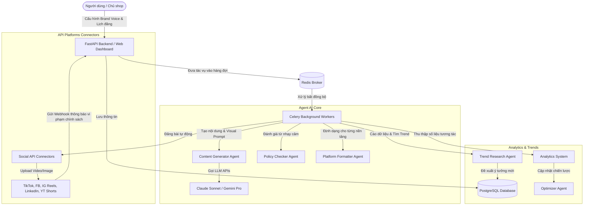

# CHIẾN LƯỢC THỰC HIỆN CÁC CHỨC NĂNG DỰ ÁN
## AI CONTENT AUTOMATION SYSTEM

Tài liệu này trình bày chiến lược công nghệ, lộ trình phát triển và thiết kế hệ thống chi tiết nhằm hiện thực hóa các chức năng được mô tả trong tài liệu [Business_Analysis.md](file:///D:/FPTU/SEMESTER%207/EXE101/repo/docs/Business_Analysis.md).

---

## 1. Kiến Trúc Hệ Thống Tổng Quan (System Architecture)

Hệ thống được thiết kế theo mô hình **Event-Driven & Microservices** nhằm đảm bảo tính mở rộng cao và khả năng xử lý bất đồng bộ các tác vụ nặng (như sinh nội dung bằng AI, xử lý media, và đăng tải bài viết lên API của bên thứ ba).



---

## 2. Thiết Kế Cơ Sở Dữ Liệu Chi Tiết (Database Schema Design)

Chúng tôi đề xuất sử dụng cơ sở dữ liệu quan hệ **PostgreSQL** để quản lý các thực thể của hệ thống. Dưới đây là cấu trúc bảng chi tiết:

### Bảng `brand_personas`
Lưu trữ thông tin cấu hình thương hiệu của người dùng.
```sql
CREATE TABLE brand_personas (
    id UUID PRIMARY KEY DEFAULT gen_random_uuid(),
    user_id VARCHAR(100) NOT NULL,
    industry VARCHAR(100) NOT NULL,
    tone VARCHAR(100) NOT NULL,
    target_audience TEXT NOT NULL,
    goals TEXT[] NOT NULL, -- Mảng các mục tiêu
    platforms VARCHAR(50)[] NOT NULL, -- Danh sách nền tảng kết nối
    posting_frequency VARCHAR(50) NOT NULL,
    preferred_hours TIME[] NOT NULL,
    created_at TIMESTAMP WITH TIME ZONE DEFAULT CURRENT_TIMESTAMP,
    updated_at TIMESTAMP WITH TIME ZONE DEFAULT CURRENT_TIMESTAMP
);
```

### Bảng `content_drafts`
Lưu trữ nội dung bản nháp do AI tạo ra.
```sql
CREATE TABLE content_drafts (
    id UUID PRIMARY KEY DEFAULT gen_random_uuid(),
    persona_id UUID REFERENCES brand_personas(id) ON DELETE CASCADE,
    idea TEXT NOT NULL,
    script TEXT NOT NULL,
    caption TEXT NOT NULL,
    hashtags VARCHAR(100)[] NOT NULL,
    media_prompt TEXT,
    media_url TEXT, -- Link file ảnh/video đã generate/upload
    cta TEXT,
    status VARCHAR(30) DEFAULT 'Draft', -- Draft, Need Review, Approved
    created_at TIMESTAMP WITH TIME ZONE DEFAULT CURRENT_TIMESTAMP
);
```

### Bảng `scheduled_posts`
Quản lý lịch đăng bài và trạng thái đăng cho từng nền tảng.
```sql
CREATE TABLE scheduled_posts (
    id UUID PRIMARY KEY DEFAULT gen_random_uuid(),
    draft_id UUID REFERENCES content_drafts(id) ON DELETE CASCADE,
    platform VARCHAR(50) NOT NULL,
    media_spec TEXT NOT NULL,
    formatted_caption TEXT NOT NULL,
    formatted_hashtags VARCHAR(100)[] NOT NULL,
    scheduled_time TIMESTAMP WITH TIME ZONE NOT NULL,
    status VARCHAR(30) DEFAULT 'Scheduled', -- Scheduled, Posting, Posted, Failed, Policy Violated
    external_post_id VARCHAR(255), -- ID bài viết trả về từ TikTok, FB...
    external_url TEXT, -- Link bài viết sau khi đăng thành công
    error_message TEXT, -- Lưu chi tiết lỗi nếu đăng bài thất bại
    created_at TIMESTAMP WITH TIME ZONE DEFAULT CURRENT_TIMESTAMP,
    updated_at TIMESTAMP WITH TIME ZONE DEFAULT CURRENT_TIMESTAMP
);
```

### Bảng `post_metrics`
Lưu trữ số liệu hiệu quả của bài đăng theo thời gian.
```sql
CREATE TABLE post_metrics (
    id UUID PRIMARY KEY DEFAULT gen_random_uuid(),
    post_id UUID REFERENCES scheduled_posts(id) ON DELETE CASCADE,
    views INT DEFAULT 0,
    likes INT DEFAULT 0,
    comments INT DEFAULT 0,
    shares INT DEFAULT 0,
    saves INT DEFAULT 0,
    ctr NUMERIC(5, 4) DEFAULT 0.0000,
    conversion_rate NUMERIC(5, 4) DEFAULT 0.0000,
    collected_at TIMESTAMP WITH TIME ZONE DEFAULT CURRENT_TIMESTAMP
);
```

---

## 3. Lộ Trình Phát Triển Chi Tiết (Implementation Roadmap)

Chúng tôi chia quy trình thực hiện dự án thành **4 giai đoạn chính**:

### Giai đoạn 1: Nền tảng Core Logic & MVP (Tuần 1 - Tuần 3)
* **Mục tiêu:** Xây dựng backend cốt lõi cho phép định nghĩa Brand Persona và kích hoạt Agent AI tạo nội dung thô.
* **Các bước triển khai:**
  1. Cài đặt môi trường dự án bằng `uv` để quản lý phiên bản Python 3.10 và cấu hình `pyproject.toml`.
  2. Phát triển API cấu hình Brand Persona cho User.
  3. Tích hợp thư viện OpenAI SDK / Anthropic SDK để gọi LLM (sử dụng kỹ thuật Prompt Engineering chuyên sâu) tạo bản nháp content dựa trên Brand Voice.
  4. Triển khai bộ lọc chính sách nội bộ (Local Policy Filter) để quét các từ nhạy cảm và gán nhãn `Need Review` cho bài viết chứa rủi ro.

### Giai đoạn 2: Tích Hợp API Nền Tảng & Lập Lịch Đăng Bài (Tuần 4 - Tuần 7)
* **Mục tiêu:** Kết nối API chính thức của các nền tảng mạng xã hội và hệ thống lập lịch tự động.
* **Các bước triển khai:**
  1. Triển khai luồng OAuth 2.0 để người dùng kết nối tài khoản TikTok Business, Facebook Pages, Instagram Graph, LinkedIn Organization.
  2. Viết các connector tích hợp API đăng bài (sử dụng phương thức upload chunk đối với video dung lượng lớn trên TikTok và Facebook).
  3. Cài đặt Redis và Celery Beat làm hệ thống hàng đợi tác vụ định kỳ, liên tục kiểm tra cơ sở dữ liệu để đăng tải các bài viết thuộc hàng đợi `Scheduled` khi đến giờ vàng.
  4. Viết webhook endpoint tiếp nhận thông báo vi phạm chính sách của platform (ví dụ Facebook Webhooks cho Page Policy Violations) để tự động cập nhật trạng thái bài viết về `Policy Violated` và cảnh báo admin.

### Giai đoạn 3: AI Trend Research & Lắng Nghe Mạng Xã Hội (Tuần 8 - Tuần 10)
* **Mục tiêu:** AI tự động phát hiện xu hướng ngành hàng và chủ động chuyển đổi thành ý tưởng nội dung.
* **Các bước triển khai:**
  1. Xây dựng dịch vụ cào dữ liệu từ các từ khóa hot trên Google Trends, TikTok Trend Discovery API và Twitter/X Search.
  2. Phát triển thuật toán lọc trend theo độ phù hợp ngành hàng bằng mô hình Embedding / Vector Database (như ChromaDB hoặc pgvector).
  3. Thiết kế luồng Agent đề xuất ý tưởng content dựa trên trend mới tìm thấy và đưa vào danh sách chờ phê duyệt của user.

### Giai đoạn 4: Vòng Lặp Tối Ưu Tự Động (Closed-Loop Optimization) (Tuần 11 - Tuần 12)
* **Mục tiêu:** AI tự động học hỏi từ số liệu hiệu suất thực tế để cải thiện chất lượng nội dung của chu kỳ tiếp theo.
* **Các bước triển khai:**
  1. Xây dựng tác vụ định kỳ quét và lấy metrics của các bài đã đăng (views, likes, shares, CTR) sau 24h, 48h, 7d.
  2. Phát triển thuật toán Optimizer: Phân tích xem tone giọng nào, khung giờ nào, hashtag nào mang lại CTR cao nhất.
  3. Xây dựng mô hình Prompt Tuning động: Hệ thống sẽ tự động ghép thêm các bài học kinh nghiệm này vào System Prompt của Content Generator trong lần sinh nội dung tiếp theo.

---

## 4. Chiến Lược Xử Lý Ngoại Lệ & Đảm Bảo Bảo Mật

### A. Quản lý Token Bảo Mật
* **Vấn đề:** Token API của các nền tảng (đặc biệt là Facebook Page Token) thường hết hạn sau 60 ngày hoặc khi người dùng đổi mật khẩu.
* **Chiến lược thực hiện:**
  * Lưu trữ Token được mã hóa trong Database bằng thuật toán **AES-256**.
  * Sử dụng cơ chế tự động làm mới token bằng **Refresh Token** chạy ẩn dưới nền trước khi token chính hết hạn.
  * Nếu Refresh Token hết hạn, lập tức chuyển trạng thái các bài đăng tương lai sang `Failed` do lỗi kết nối và gửi email/thông báo đẩy yêu cầu người dùng kết nối lại tài khoản.

### B. Cơ chế Tự Động Thử Lại (Retry Policy)
* **Vấn đề:** API của mạng xã hội thỉnh thoảng bị lỗi gián đoạn hoặc bị nghẽn mạng.
* **Chiến lược thực hiện:**
  * Sử dụng cấu hình retry của Celery với chiến thuật **Exponential Backoff** (thử lại sau 1 phút, 5 phút, 15 phút, tối đa 3 lần).
  * Chỉ thử lại với các mã lỗi mạng hoặc lỗi hệ thống của Platform (HTTP 5xx). Không thử lại đối với lỗi xác thực (401) hoặc vi phạm dữ liệu (400) để tránh lãng phí tài nguyên.

---

## 5. Khuyến Nghị Công Nghệ (Recommended Tech Stack)

| Thành phần | Công nghệ lựa chọn | Lý do |
| --- | --- | --- |
| **Ngôn ngữ lập trình** | Python 3.10 | Hỗ trợ tốt nhất các thư viện AI/ML và có tính năng gõ kiểu dữ liệu mạnh mẽ. |
| **Package Manager** | `uv` | Tốc độ cài đặt thư viện nhanh hơn gấp 10-100 lần so với pip/poetry, hỗ trợ tốt quản lý môi trường ảo. |
| **Backend Framework** | FastAPI | Tốc độ thực thi cực nhanh, hỗ trợ lập trình bất đồng bộ (async/await), tự động tạo tài liệu API Swagger. |
| **Database** | PostgreSQL | Hỗ trợ dữ liệu quan hệ mạnh mẽ, hỗ trợ lưu trữ mảng/JSONB và mở rộng tốt bằng pgvector cho AI. |
| **Task Queue** | Celery + Redis | Hỗ trợ lập lịch đăng bài chuẩn xác, chịu tải tốt khi phân chia nhiệm vụ cho nhiều Worker chạy ngầm. |
| **AI LLM API** | Claude 3.5 Sonnet / Gemini 1.5 Pro | Claude cho kết quả sáng tạo kịch bản tự nhiên nhất; Gemini có context window lớn thích hợp xử lý video dài. |
