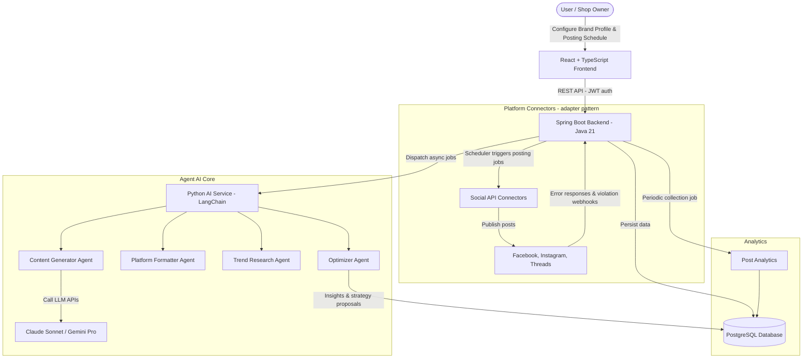

# PROJECT FEATURE IMPLEMENTATION STRATEGY
## AIMA — AI CONTENT AUTOMATION SYSTEM

This document presents the technology strategy, development roadmap, and detailed system design for implementing the features described in [Business_Analysis.md](./Business_Analysis.md), following the scope and requirements defined in [REQUIREMENTS.md](./REQUIREMENTS.md), [DATA_MODEL.md](./DATA_MODEL.md), [UI_API.md](./UI_API.md), and [GLOSSARY.md](./GLOSSARY.md).

> Platform scope: **Facebook → Instagram → Threads**, in that order. The integration layer is designed as adapters/interfaces so new platforms (TikTok, YouTube Shorts, LinkedIn) can be added later (NFR-09).

---

## 1. System Architecture Overview

The system consists of three services, matching the technology stack in [Technical.md](./Technical.md): a **React frontend**, a **Java 21 + Spring Boot backend** (business logic, authentication, scheduling, platform connectors), and a **Python 3.10 AI service** (LangChain-based agents). All AI and posting tasks run **asynchronously** as background jobs (NFR-04).



Key responsibilities:

* **Spring Boot backend** — user accounts (JWT, OAuth2), Brand Profile / Strategy APIs, the **Scheduler** (checks the posting calendar, triggers posting jobs at the scheduled time, runs trend research at 2:00 AM daily), token refresh jobs, retry handling, and webhook endpoints for platform violation notifications.
* **Python AI service** — the four agents (research, generate, format, optimize), invoked asynchronously by the backend. The MVP generates **text media prompts only**, never the media itself (FR-29).
* **PostgreSQL** — single source of truth for all entities, with pgvector available for trend-relevance embeddings.

---

## 2. Database Schema Design

The schema follows the entities defined in [DATA_MODEL.md](./DATA_MODEL.md) (BrandProfile, ContentStrategy, PlatformAccount, ContentItem, ContentVersion, PostSchedule, Post, PostingJob, PostAnalytics, and the trend/insight entities). **Soft delete is the default** — every table carries a `deleted_at` column; hard delete only on a full GDPR account-deletion request.

Representative core tables:

### Table `brand_profiles`
Stores the user's brand configuration (FR-05).
```sql
CREATE TABLE brand_profiles (
    id UUID PRIMARY KEY DEFAULT gen_random_uuid(),
    user_id UUID NOT NULL,
    brand_name VARCHAR(150) NOT NULL,
    industry VARCHAR(100) NOT NULL,
    description TEXT,
    brand_voice VARCHAR(100) NOT NULL,
    target_audience TEXT NOT NULL,
    content_goals TEXT[] NOT NULL,
    platforms VARCHAR(50)[] NOT NULL, -- Facebook, Instagram, Threads
    posting_frequency VARCHAR(50) NOT NULL,
    preferred_hours TIME[] NOT NULL,
    created_at TIMESTAMP WITH TIME ZONE DEFAULT CURRENT_TIMESTAMP,
    updated_at TIMESTAMP WITH TIME ZONE DEFAULT CURRENT_TIMESTAMP,
    deleted_at TIMESTAMP WITH TIME ZONE -- soft delete
);
```

### Table `platform_accounts`
Connected social accounts and their tokens (FR-14 to FR-18).
```sql
CREATE TABLE platform_accounts (
    id UUID PRIMARY KEY DEFAULT gen_random_uuid(),
    user_id UUID NOT NULL,
    platform_name VARCHAR(50) NOT NULL, -- Facebook, Instagram, Threads
    account_name VARCHAR(150) NOT NULL,
    access_token TEXT NOT NULL,  -- AES-256 encrypted, never returned to the frontend (SEC-03)
    refresh_token TEXT,          -- AES-256 encrypted
    token_expires_at TIMESTAMP WITH TIME ZONE,
    connection_status VARCHAR(20) DEFAULT 'Active', -- Active, Expired, Disconnected
    connected_at TIMESTAMP WITH TIME ZONE DEFAULT CURRENT_TIMESTAMP,
    deleted_at TIMESTAMP WITH TIME ZONE
);
```

### Table `content_items`
Original AI-generated content, before platform formatting (FR-24 to FR-31).
```sql
CREATE TABLE content_items (
    id UUID PRIMARY KEY DEFAULT gen_random_uuid(),
    brand_profile_id UUID REFERENCES brand_profiles(id),
    content_idea_id UUID, -- references the trend-derived idea, if any
    script TEXT NOT NULL,
    caption TEXT NOT NULL,
    hashtags VARCHAR(100)[] NOT NULL,
    cta TEXT,
    media_prompt TEXT, -- MVP: text description only, no media generation (FR-29)
    status VARCHAR(30) DEFAULT 'Draft', -- Draft, Generated, Need Review, Approved
    created_at TIMESTAMP WITH TIME ZONE DEFAULT CURRENT_TIMESTAMP,
    deleted_at TIMESTAMP WITH TIME ZONE
);
```

### Table `content_versions`
One formatted version per platform (FR-40, FR-46). One ContentVersion maps to one PostSchedule.
```sql
CREATE TABLE content_versions (
    id UUID PRIMARY KEY DEFAULT gen_random_uuid(),
    content_item_id UUID REFERENCES content_items(id),
    platform_name VARCHAR(50) NOT NULL,
    formatted_caption TEXT NOT NULL,
    formatted_hashtags VARCHAR(100)[] NOT NULL,
    media_format VARCHAR(50), -- e.g. vertical video, square image
    status VARCHAR(30) DEFAULT 'Formatted',
    created_at TIMESTAMP WITH TIME ZONE DEFAULT CURRENT_TIMESTAMP,
    deleted_at TIMESTAMP WITH TIME ZONE
);
```

### Table `post_schedules`
The posting calendar and post lifecycle state (FR-47 to FR-55).
```sql
CREATE TABLE post_schedules (
    id UUID PRIMARY KEY DEFAULT gen_random_uuid(),
    content_version_id UUID REFERENCES content_versions(id),
    platform_account_id UUID REFERENCES platform_accounts(id),
    scheduled_time TIMESTAMP WITH TIME ZONE NOT NULL,
    -- Scheduled, Posting, Posted, Failed, Retrying, On Hold (see the state machine in WORKFLOWS.md)
    status VARCHAR(30) DEFAULT 'Scheduled',
    external_post_id VARCHAR(255), -- Post ID returned by the platform
    external_url TEXT,             -- Link to the post after successful publishing
    error_code VARCHAR(50),        -- Original platform error code, if publishing failed
    error_message TEXT,            -- Original platform error message (FR-35)
    created_at TIMESTAMP WITH TIME ZONE DEFAULT CURRENT_TIMESTAMP,
    updated_at TIMESTAMP WITH TIME ZONE DEFAULT CURRENT_TIMESTAMP,
    deleted_at TIMESTAMP WITH TIME ZONE
);
```

### Table `posting_jobs`
Each publishing attempt, including retries (one post can have many jobs).
```sql
CREATE TABLE posting_jobs (
    id UUID PRIMARY KEY DEFAULT gen_random_uuid(),
    post_schedule_id UUID REFERENCES post_schedules(id),
    started_at TIMESTAMP WITH TIME ZONE,
    ended_at TIMESTAMP WITH TIME ZONE,
    retry_count INT DEFAULT 0,
    status VARCHAR(30) NOT NULL,
    error_message TEXT
);
```

### Table `post_analytics`
Post performance metrics, collected repeatedly over time (FR-59, FR-60).
```sql
CREATE TABLE post_analytics (
    id UUID PRIMARY KEY DEFAULT gen_random_uuid(),
    post_schedule_id UUID REFERENCES post_schedules(id),
    views INT DEFAULT 0,
    likes INT DEFAULT 0,
    comments INT DEFAULT 0,
    shares INT DEFAULT 0,
    saves INT DEFAULT 0,
    ctr NUMERIC(5, 4) DEFAULT 0.0000,
    conversion_rate NUMERIC(5, 4) DEFAULT 0.0000,
    watch_time INT DEFAULT 0, -- seconds
    collected_at TIMESTAMP WITH TIME ZONE DEFAULT CURRENT_TIMESTAMP
);
```

The trend entities (`trend_research_sessions`, `trends`, `content_ideas`) and optimization entities (`optimization_insights`, `strategy_adjustments`) follow the attribute lists in DATA_MODEL.md.

---

## 3. Implementation Roadmap

We divide the project delivery into **4 main phases**:

### Phase 1: Core Foundation & MVP (Weeks 1–3)
* **Goal:** Build the core backend and AI service so users can define a Brand Profile and the Agent AI can generate draft content.
* **Implementation steps:**
  1. Set up the Spring Boot backend: user registration/login with JWT, Google OAuth2, profile management (FR-01 to FR-04).
  2. Develop the Brand Profile and Content Strategy APIs with validation (FR-05 to FR-13), plus the onboarding wizard flow (FR-85, FR-86).
  3. Set up the Python AI service with `uv` (Python 3.10) and LangChain; integrate the LLM SDKs to generate content drafts (script, caption, hashtags, CTA, media prompt) from the Brand Voice (FR-24 to FR-31). Media prompts are **text only** — no media generation in the MVP (FR-29).
  4. Build the content review workspace: review, edit, and regenerate before scheduling (FR-32 to FR-34, UI-06). Per **SEC-06**, no custom content filter is built — content safety relies on user review plus platform violation handling (Phase 2).

### Phase 2: Platform API Integration & Post Scheduling (Weeks 4–7)
* **Goal:** Connect the official platform APIs and the automatic scheduling system.
* **Implementation steps:**
  1. Implement the OAuth 2.0 connection flows in scope order: **Facebook Pages → Instagram Graph → Threads** (FR-14 to FR-17), behind an adapter/interface layer so platforms can be added later (NFR-09).
  2. Write the publishing connectors for each platform (chunked upload for large video files where the platform requires it).
  3. Build the Scheduler as a backend background job: check the posting calendar, suggest golden hours (defaults per platform, switching to data-driven suggestions after ≥10 posts with analytics — FR-48), and trigger posting jobs at the scheduled time (FR-47 to FR-55).
  4. Implement the retry policy (FR-56): up to 3 retries at 5/15/30-minute intervals, temporary errors only.
  5. Handle policy violations from platform responses and webhooks (FR-35 to FR-39): classify HTTP 400/403 policy errors, set the post to `Failed` with the original error code/message, **never retry**, and notify the user with the platform, reason, and next steps.
  6. Build the token refresh job (FR-18a: auto-refresh when the token has < 24h remaining) and the expiry flow (FR-18b: mark the account `Expired`, move its `Scheduled` posts to `On Hold`, and ask the user to reconnect).

### Phase 3: AI Trend Research (Weeks 8–10)
* **Goal:** The AI automatically detects industry trends and proactively converts them into content ideas.
* **Implementation steps:**
  1. Build the trend collection service for the in-scope platforms (plus general sources such as Google Trends), running on schedule (default **2:00 AM daily**) with a manual "Research now" trigger (FR-19). It runs only when a Brand Profile and an `Active` Strategy exist, and never starts a new session while one is still running.
  2. Develop the trend-relevance filtering algorithm by industry using embedding models with pgvector, rating each trend High / Medium / Low (FR-20, FR-21).
  3. Design the agent flow that converts promising trends into content ideas (trend name, suitable platform, relevance, description, execution suggestions) and saves each research session (FR-22, FR-23).

### Phase 4: Closed-Loop Optimization (Weeks 11–12)
* **Goal:** The AI learns from real performance data to improve content quality in the next cycle.
* **Implementation steps:**
  1. Build a periodic job that collects metrics for published posts (views, likes, comments, shares, saves, CTR, conversion, watch time) at 24h, 48h, and 7d (FR-59 to FR-62). Analytics may not be real-time (CON-04); if collection fails, retry later and keep the post `Posted` (EX-05).
  2. Develop the Optimizer agent: analyze which hook, caption, hashtags, CTA, media, time slot, and platform yield the best results, and produce optimization insights (FR-63, FR-64).
  3. Generate strategy adjustment proposals for the user to **accept or reject** (FR-65 to FR-68); accepted adjustments are stored and applied to the next cycle.
  4. Build dynamic prompt tuning: automatically append accepted lessons learned to the Content Generator's system prompt for the next generation run.

---

## 4. Exception Handling & Security Strategy

### A. Secure Token Management
* **Problem:** Platform API tokens (especially Facebook Page Tokens) typically expire after 60 days or when the user changes their password.
* **Strategy:**
  * Store access/refresh tokens encrypted in the database using **AES-256**; tokens are never returned to the frontend (SEC-03).
  * A background job automatically refreshes tokens that have less than 24 hours of validity remaining, keeping the connection `Active` (FR-18a).
  * If the token has fully expired, mark the account `Expired`, move that platform's `Scheduled` posts to **`On Hold`**, and send an email/push notification asking the user to reconnect (FR-18b). Once reconnected, the posts return to `Scheduled`.

### B. Automatic Retry Policy
* **Problem:** Social media APIs occasionally suffer transient failures or network congestion.
* **Strategy:**
  * Retry up to **3 times at 5/15/30-minute intervals** (FR-56).
  * Only retry temporary errors: timeouts, rate limits, network errors, and platform-side system errors (HTTP 5xx).
  * Never retry authentication errors (401) or policy/data violations (400/403) — these require user action.

### C. Policy Violation Handling (SEC-06)
* **Principle:** The system does **not** build its own content filter. It relies on user review before scheduling and handles the platforms' violation responses precisely.
* **Strategy:**
  * Classify platform errors as policy violations vs. technical errors (FR-37).
  * On violation: set the post to `Failed`, store the original error code and message, do not retry, and notify the user with the platform, reason, and next steps (FR-35, FR-38).
  * Provide webhook endpoints for post-publication violation notifications, updating the post status and alerting the User/Admin.
  * The user can edit or regenerate the content and schedule it again (FR-39).

---

## 5. Technology Stack

Per [Technical.md](./Technical.md):

| Component | Chosen technology | Rationale |
| --- | --- | --- |
| **Frontend** | React + TypeScript (Tailwind CSS, React Router, Axios) | Component-based, type-safe UI with fast, responsive styling. |
| **Backend** | Java 21 + Spring Boot (Spring Web, Data JPA, Security + JWT, OAuth2) | Stable, scalable framework for business logic, authentication, scheduling, and platform connectors. |
| **AI service** | Python 3.10 + LangChain (managed with `uv`) | Best ecosystem for LLM agent orchestration; `uv` provides fast dependency and environment management. |
| **Database** | PostgreSQL | Strong relational support, array/JSONB storage, and trend-embedding search via pgvector. |
| **Async jobs & scheduling** | Spring scheduling + database-backed job queue | Drives posting at the right time, token refresh, retries, and periodic analytics/research jobs (NFR-04). |
| **AI LLM API** | Claude Sonnet / Gemini Pro | Claude produces the most natural creative scripts; Gemini's large context window suits long-form input processing. |
